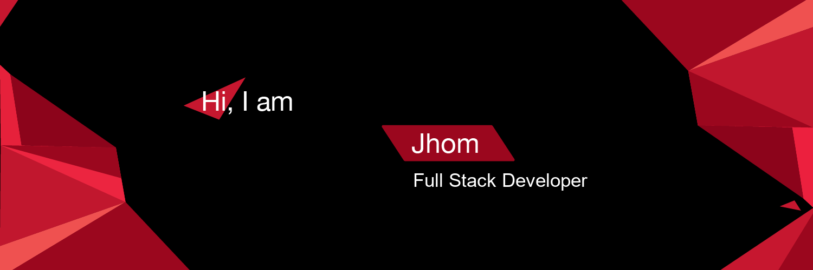

## Hi there, welcome to my GitHub. 

I'm a full stack developer who enjoys building web applications using modern technologies and frameworks. 🚀

I'm also diving deeper into system design, cloud architecture, CI/CD and other shenanigans, while exploring how AI can speed up the way I build.

### Contact me

  
  
  
  
  

 
 
 

### Technology Stack 💻

  
  
  
  
  
  
  
  
  
  
  
  
  
  
  

### Version Control and Development Tools 🛠

  
  
  
  
  
 
 
 
 
 

<!--### GitHub stats 📈

 
  

 -->

<!--
**DevJhom/DevJhom** is a ✨ _special_ ✨ repository because its `README.md` (this file) appears on your GitHub profile.

Here are some ideas to get you started:

- 🔭 I’m currently working on ...
- 🌱 I’m currently learning ...
- 👯 I’m looking to collaborate on ...
- 🤔 I’m looking for help with ...
- 💬 Ask me about ...
- 📫 How to reach me: ...
- 😄 Pronouns: ...
- ⚡ Fun fact: ...
-->
